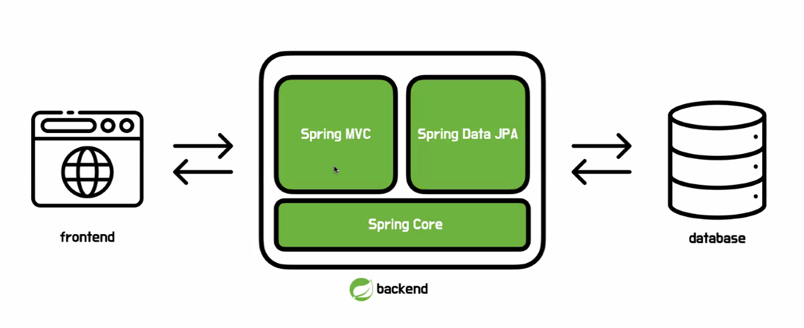

> 24.06.03 월

> 리뷰 방법: https://github.com/next-step/nextstep-docs/blob/master/codereview/README.md

<!-- TOC -->
  * [코드 리뷰 프로세스](#코드-리뷰-프로세스)
  * [과정을 슬기롭게 임하는 방법](#과정을-슬기롭게-임하는-방법)
    * [주변 환경을 정리해 꾸준히 연습할 시간 확보](#주변-환경을-정리해-꾸준히-연습할-시간-확보)
    * [매일 1~2시간씩 미션 진행하기](#매일-12시간씩-미션-진행하기)
    * [리뷰어 피드백이 상반되는 경우](#리뷰어-피드백이-상반되는-경우)
    * [슬랙 DM으로 리뷰 요청하기](#슬랙-dm으로-리뷰-요청하기)
    * [정답을 찾기 위해 집착하지 않기](#정답을-찾기-위해-집착하지-않기)
    * [리뷰 적극 수용의 마인드. 편한길로만 가지 말자](#리뷰-적극-수용의-마인드-편한길로만-가지-말자)
  * [스프링을 대하는 우리들의 자세](#스프링을-대하는-우리들의-자세)
    * [재미있게 학습하자](#재미있게-학습하자)
  * [그래서 뭘 배우나요?](#그래서-뭘-배우나요)
<!-- TOC -->

## 코드 리뷰 프로세스

## 과정을 슬기롭게 임하는 방법

### 주변 환경을 정리해 꾸준히 연습할 시간 확보

> 여러분의 의지력을 믿지 마세요. 환경을 바꾸세요.

- 환경 바꾸기
  - TV를 보지 않는다. 
  - 스마트폰 보는 시간을 줄인다.

- 시간을 확보하기
  - 퇴근 후 카페로 출근한다.
  - 야근을 하지 않는다.

 

### 매일 1~2시간씩 미션 진행하기

- 한 번에 모두 구현보다 매일 일정한 시간 투자가 중요!
- 최소 하루에 2시간 이상 투자해야 미션 완료 가능.
- **마음껏 생각하고 자신만의 프로그래밍 색깔 만들기!**
  - _(미션마다 리뷰어가 달라진다.)_
  - 리뷰어는 가르치는 사람이 아니라, 경험을 공유해주는 사람.
    - 건설적인 코드 리뷰가 되도록..!

### 리뷰어 피드백이 상반되는 경우

- 상반되는 의견에 혼란스러워하지 말고 즐기기.
  - 코멘트로 생각과 함께 리뷰어에게 자유롭게 질문!
- 상반되는 의견에 대해 생각할 수 있는 계기로 생각하기.
- **마음껏 생각하고 자신만의 프로그래밍 색깔 만들기!**

### 슬랙 DM으로 리뷰 요청하기

- 깃허브 알림보다 리뷰어에게 DM으로 알려주기!

### 정답을 찾기 위해 집착하지 않기

- 미션을 진행하는데 정답은 없음.
- 정답을 찾으려는 노력이 **_오히려 학습을 방해한다._**
- **_현재 상황에서 최선의 답을 끊임없이 찾으려고 노력한다._**

### 리뷰 적극 수용의 마인드. 편한길로만 가지 말자

- 프로덕트를 배포하려고 구현하는 것이 아님.
- 이런 요구사항이 있을 때 스프링의 어떤 기능을 사용해본다든지.
- 평소에 많이 안 해본 것을 시도해보자.
  - 리뷰어 피드백을 수용해보면서, 적극적으로 해보기. 
  - _이런 방식으로 코드를 구현해볼까?_
    - **_리뷰어랑 DM을 적극 활용하자!_**

 

## 스프링을 대하는 우리들의 자세

- 스프링을 마스터 하겠다는 마음 보다는,
  - 하나의 도구로서 **필요한 기능을 익혀서**,
  - **요구사항을 해결**하겠다는 생각하기.
- 무의식적으로 짜고 있었다면, 의식적으로 객체지향, 클린 코드 등을 적용.
  - 자기만의 북극성 찾기.

    
### 재미있게 학습하자

- 스트레스 받으면서 하기 보다는, 내가 쌓은 지식을 흥미롭게 미션에 녹여보자.
- 이론적인 지식보다는, 학습 테스트를 통해서 공부하면 즐겁게 공부 할 수 있을 것.

 

## 그래서 뭘 배우나요?

- backend를 효과적으로 개발하기 위한 spring.
- 도구로서의 spring. spring 코어 위의 기반 기술들.
- 스프링 생태계에 필요한 모듈 이해.

---

# 첫 미션

- 1단계에서 1-1~1-3까지 다하고 리뷰 요청.
- 2단계에서 2-1~2-3까지 다하고 리뷰 요청. 